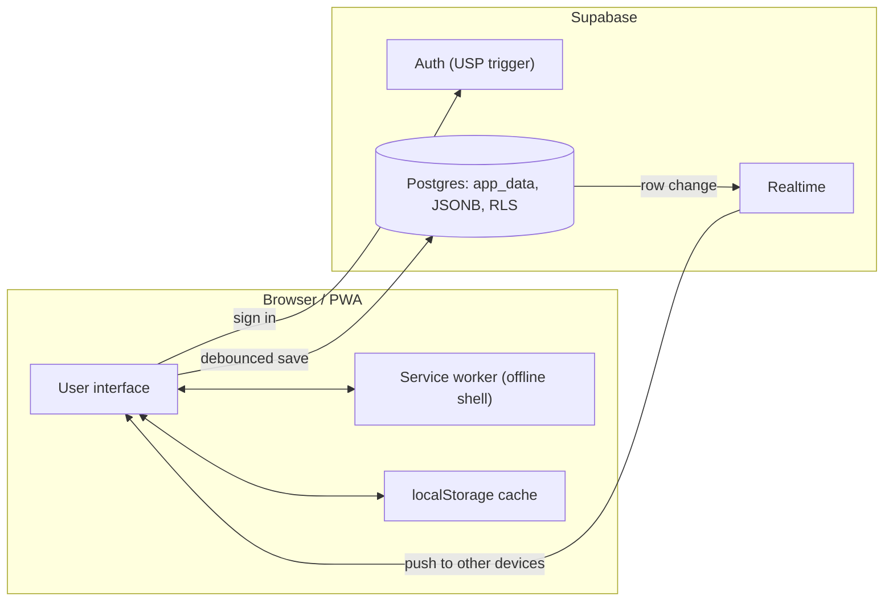

<div align="center">


# M87 · Class Attendance Tracker

A cloud-synchronized Progressive Web Application for University of Sao Paulo (USP)
students to track attendance, manage academic schedules and monitor absence limits
across devices.

[](https://app.netlify.com/projects/m-87/deploys)
[](https://m-87.netlify.app)
[](https://supabase.com)

**Live demo:** [m-87.netlify.app](https://m-87.netlify.app)

</div>

---

## Screenshots

| Absences | Calendar | Subjects |
| :---: | :---: | :---: |
|  |  |  |

## Demo

<div align="center">


</div>

## Install on your device

M87 can be installed as an app, with its own icon and a dedicated window.

| Android (Chrome) | iOS (Safari) |
| :---: | :---: |
|  |  |

- Android (Chrome): open the site, open the menu ⋮ and choose Add to Home Screen.
- iOS and iPadOS (Safari): open the site, tap Share and choose Add to Home Screen.
- Desktop (Chrome or Edge): open the site and click the install icon in the address bar. Alternatively, open the ⋮ menu, then choose "Cast, save, and share" and click Install M87.

## Overview

M87 is a Progressive Web Application designed for University of Sao Paulo students to
manage attendance throughout the academic semester. It records absences per subject and
per individual class meeting, calculates how many absences are still allowed in each
subject, and presents the whole semester on a calendar.

The application lets students:

- Register absences per subject and per class meeting.
- Monitor the remaining absence margin in real time.
- Visualize attendance history on a monthly calendar.
- Synchronize data automatically across multiple devices.
- Manage semesters, schedules, rooms and professors.

Built with vanilla JavaScript and Supabase, M87 combines a lightweight frontend (no
framework and no build step) with cloud persistence and real-time synchronization.

## Key Features

### Attendance tracking
- Per-subject and per-meeting absence control.
- Automatic absence-limit calculation based on course credits.
- Visual progress bars that change color as the limit approaches.
- Warning states and notifications when only one absence is left and when the limit is reached.

### Academic organization
- Multiple semesters (up to 18).
- Custom schedules with morning, afternoon, evening, full-time and user-defined time slots.
- Room and professor information per meeting, with one-tap email copy.
- Subject color customization with gradient palette.
- Notes attached to specific dates.
- Holidays and no-class days excluded from the limit.

### Cloud synchronization
- Secure authentication through Supabase Auth.
- Real-time sync across phone, tablet and desktop.
- Connection indicator (online, saving, offline) with editing paused while offline.
- Persistent cloud storage, one JSON document per user.

### Progressive Web App
- Installable on desktop and mobile, with offline support.
- Responsive interface: bottom navigation on mobile, collapsible sidebar and two-column
  layout on desktop.
- Three languages (Portuguese, English, Spanish) with automatic detection of the system language.
- Fast loading through a service worker that caches the app shell.

## Authentication

Access is restricted to University of Sao Paulo accounts, enforced by a database trigger.
Supported domains:

- `@usp.br`
- any USP subdomain such as `@alumni.usp.br`

Account creation requires registration with a valid institutional email, email
confirmation, and successful authentication through Supabase Auth.

## Attendance rules

The absence limit follows the USP rule of a maximum of 25 percent of missed classes:

- A 4-credit course (two weekly meetings) allows up to 8 absences.
- A 2-credit course (one weekly meeting) allows up to 4 absences.
- Each missed meeting counts as one absence. Missing both meetings of a day counts as two.
- Holidays, no-class days and professor absences are not counted toward the limit.

## Technology stack

| Layer | Technology |
| --- | --- |
| Frontend | HTML5, CSS3, vanilla JavaScript (ES2021) |
| PWA | Web App Manifest, Service Worker (network-first) |
| Internationalization | Custom dictionary (Portuguese, English, Spanish) |
| Authentication | Supabase Auth (USP email enforced by trigger) |
| Database | Supabase Postgres, JSONB document per user |
| Security | Row Level Security (RLS) |
| Realtime | Supabase Realtime (postgres_changes) |
| Hosting | Netlify (auto-deploy from GitHub) |
| Domain | m-87.netlify.app |

## Architecture



### Data flow
1. The user authenticates through Supabase Auth.
2. All app state (semesters, subjects, occurrences, notes) is stored as a single JSONB row.
3. Row Level Security isolates each user's records.
4. Saves are debounced and mirrored to localStorage for instant loads.
5. Realtime broadcasts row changes, and connected devices update automatically. A device
   id is attached to each write so a client ignores the echo of its own changes.

## Local development

No dependencies and no build step. Serve the folder over HTTP, since a service worker
requires `http://` or `https://` rather than `file://`.

```bash
python -m http.server 8700
# then open http://localhost:8700
```

On Windows you can also just double-click `start.bat`, which starts a local
server on port 8700 and opens the browser. It works from any folder.

### Backend configuration (optional)

Cloud login and sync are powered by Supabase. Open `supabase.js` and set:

```js
const SUPABASE_URL = "https://YOUR-PROJECT.supabase.co";
const SUPABASE_ANON_KEY = "your-anon-public-key";
```

Leaving both empty runs the app fully offline with no login screen.

## Deployment

The application is a static site hosted on Netlify at
[m-87.netlify.app](https://m-87.netlify.app), built directly from this GitHub repository.
Every push to the default branch triggers an automatic redeploy. All paths are relative,
so the app works equally at a domain root or a sub-path.

## Roadmap

- [ ] Path-based routing (`/calendar`) instead of hash routing
- [ ] Shareable and exportable semester schedule
- [ ] Reminders before reaching an absence limit
- [ ] Optional light theme
- [ ] Advanced analytics dashboard

## License

Released under the [MIT License](LICENSE).

Built by [viwctor](https://github.com/viwctor) with Claude Code.
